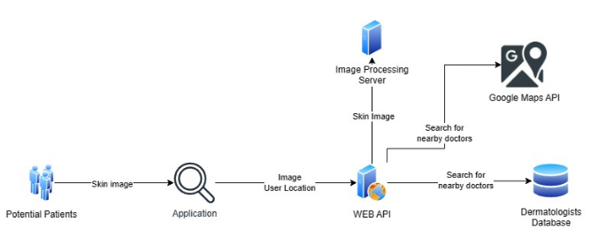
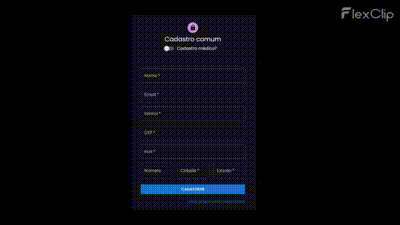

## Funcionamento da Aplicação - Medical Intelligence

A aplicação foi desenvolvida com 2 `API's` e 1 `APP (Front)`.

> - **Banco de dados:** MongoDB
> - **API Aplicação:** TypeScript
> - **API Inteligência Artificial:** Python (Flask)

#### 👩🏻‍💻 **_Modelo da aplicação_**
<div align="center"> 
    
</div>

<hr>

## 🖼️ Interface de usuário

A interface de usuário foi desenvolvida seguindo o seguinte modelo:

- Apenas pessoas cadastradas podem utilizar o serviço.
- A dois tipos de registros: `Usuário comum e Médico`.
- Todos podem utilizar o classificador.
- Irá ser mostrado todos médicos próximos a pessoa após a utilização da classificação.
- Pode-se consultar o histórico de classificações.

<div align="center"> 
    
</div>


<hr>

## 🤖 Inteligência Artificial

Foi utilizando um vasto banco de dados disponível no [Kaggle](https://www.kaggle.com/datasets/bhanuprasanna/isic-2019).

- **Sobre o dataset:**
    - Este é um conjunto de dados derivado do site de origem da competição ISIC.
    - O conjunto de dados original contém mais de 25.000 imagens classificadas em 8 doenças de pele.
    - Este conjunto de dados criado permite a classificação de doenças de pele e o conjunto de dados é dividido em 3 conjuntos: treinamento, teste e válido.
    - Este conjunto de dados facilita a vida dos desenvolvedores, pois eles podem usá-lo para criar modelos para classificação de imagens sobre doenças de pele.

<hr>

### 📡 Rodar o projeto

Para rodar o projeto você deve ter disponivel na pasta `/server-ai/treined-model/` o modelo treinado. Além disso `.env` para rodar o `/server/` que não ficará disponivel open-source, porém como o MongoDB é gratuito você pode simular o mesmo banco seguindo o `.env.example`.

#### Requisitos:
> - Yarn - TypeScript
> - Python
> - React

#### 💛 Comandos para baixar e rodar:

Após todos os requisitos estarem baixados em sua máquina basta rodar os seguintes comandos:

- **🗂️ Client:**
    ```
    yarn install
    ```

    ```
    yarn start
    ```
- **🗂️ Server:**
    ```
    yarn install
    ```

    ```
    yarn start
    ```
- **🗂️ Server AI:**
    ```
    pip install -r requirements.txt
    ```

    ```
    python main.py
    ```
